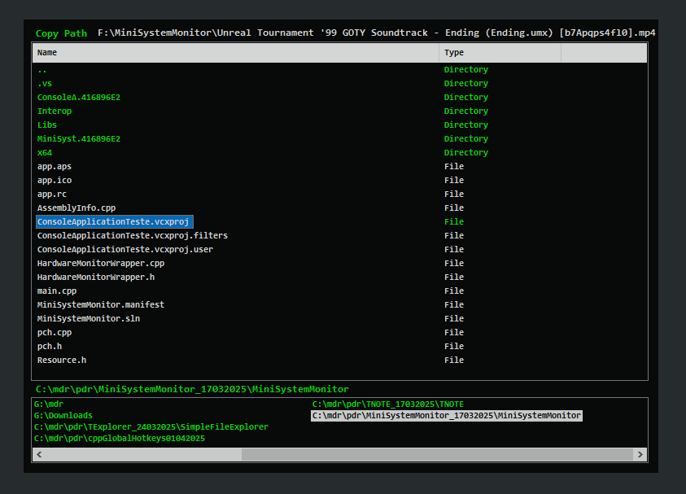

# TExplorer
Minimalist Translucent File Explorer. Designed to be safe and to be used mainly with keyboard input.

 

Commands:
1. Esc : quit the program or empty the file list for copy/move.
2. Alt+Arrow_Key : Move the application window.
3. Right Arrow Key : Enter a directory.
4. Left Arrow Key : Go to parent directory.
5. Space : Open the context menu for more options.
6. Up, Down Arrow Key : Select items inside the current directory.
7. Enter Key : ... do things ...
8. Delete Key : Used to delete files and directories. (Only in Delete Mode).
9. Tab : Change focus between session shortcuts or main listview.
10. Ctrl+S (on main listview) : Save a current directory as a session shortcut.
11. Delete (on session shortcuts) : Remove a session shortcut.

Modes:
1. Copy Path : Copy the select item path to clipboard.
2. Copy : Copy files and directories selecting with enter sending these files to clipboard.
3. Cut : Cut files and directories selecting with enter sending these files to clipboard to be moved.
4. Paste : Paste the clipboard files, moving or copying depending of the previous mode.
5. Execute : Execute a .exe file.
6. Delete : Select with enter the files to be deleted and press delete key to delete these files.
7. Rename : In the rename mode, press enter to rename a selected file.

Context Menu Options:
1. Copy Path : set the Copy path mode.
2. Set Directory (Path) : Manually write the current directory path
3. File Operations : set the modes for copy, cut, paste, delete.
4. Open : open a file with default program.
5. Execute : Set mode to execute.
6. Windows Explorer : Open the current directory of pointed file in the windows explorer (explorer.exe) or if the pointed item is a directory open the directory.
7. Windows CMD : Open the command prompt (cmd.exe) in the current directory of pointed file or if the pointed item is a directory open inside that directory.

## Videos
1. https://youtu.be/U5DsChUS2is?si=P-B_WGgtpNVgcBhv
2. https://youtu.be/tlE5NIXcAfw?si=0EmuQ193yQdUGHAO
3. https://youtu.be/Rvcw2chJIaU?si=Fn_un90_Cq8GE2j4
